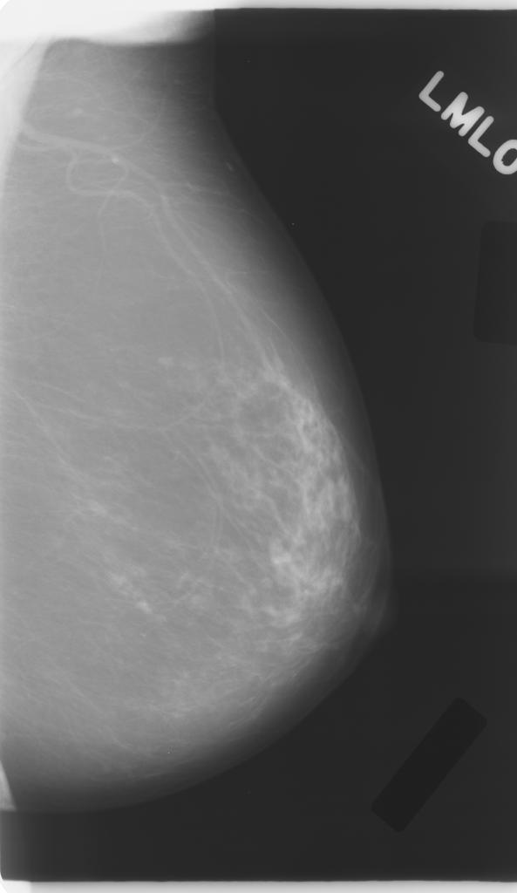
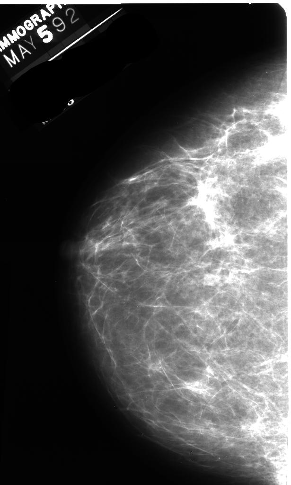
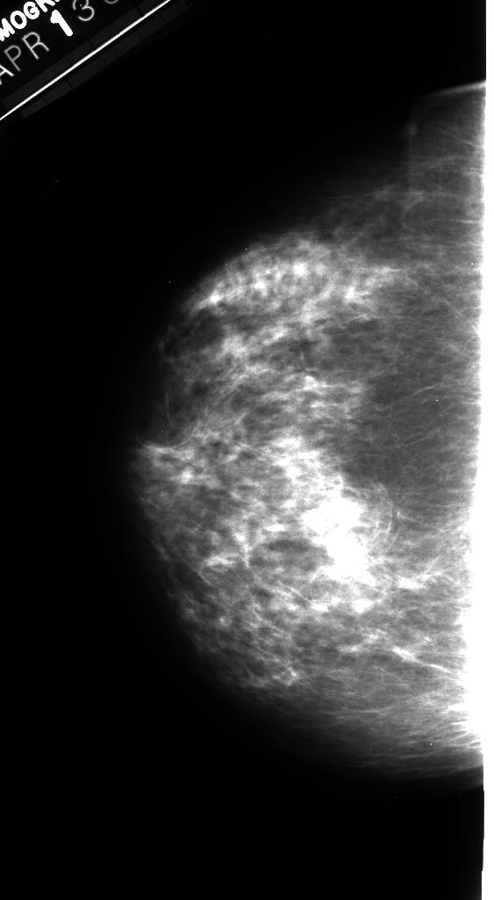
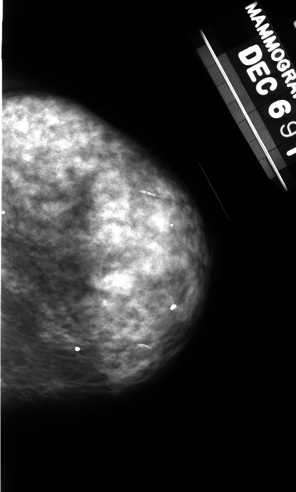

# Trabalho final de PI

A densidade da mama é comprovadamente relacionada com o risco do desenvolvimento de câncer,
uma vez que mulheres com uma maior densidade mamária podem esconder lesões, levando o câncer
a ser detectado tardiamente. A escala de densidade chamada BIRADS foi desenvolvida pelo
American College of Radiology e informa os radiologistas sobre a diminuição da sensibilidade do
exame com o aumento da densidade da mama. BI-RADS definem a densidade como sendo quase
inteiramente composta por gordura (densidade I), por tecido fibrobroglandular difuso (densidade II),
por tecido denso heterogêneo (III) e por tecido extremamente denso (IV). A mamografia é a principal
ferramenta de rastreio do câncer e radiologistas avaliam a densidade da mama com base na análise
visual das imagens.

  

  

  

  

Neste trabalho, você deverá implementar um aplicativo que leia imagens de exames mamográficos e
possibilite o reconhecimento automático da densidade da mama, utilizando técnicas de descrição por
textura.

# Especificações do programa

a) O programa deve ser implementado em C, C++, Python 3.8 ou Java.

b) É permitido o uso de funções elementares de bibliotecas. Por função elementar entende-se
uma função básica de manipulação de imagens, cujo resultado não seja a solução final do
problema. Ex: leitura de arquivos, cálculo de histogramas, filtros, cálculo de distâncias,
conversão entre formatos de imagens, cálculo de características.

c) O ambiente deve ser totalmente gráfico e deverá oferecer as seguintes opções:
* Ler e visualizar imagens nos formatos PNG e JPG. As imagens podem ter qualquer
resolução e número de tons de cinza (normalmente variando entre 8 e 16 bits por
pixel);
* Ler um diretório contendo 4 subdiretórios com os arquivos de imagens previamente
recortadas, associadas às 4 classes BIRADS. Os nomes dos subdiretórios serão 1,2,3 e
4. Essas imagens servirão para treinar e testar o classificador.
* Oferecer um menu com opções para ler o diretório de imagens de treino/teste; treinar o
classificador; abrir e visualizar uma imagem; calcular e exibir as características para a
imagem visualizada ou área selecionada; classificar a imagem ou a região de interesse
selecionada com o mouse.
* Caracterizar uma imagem ou região selecionada através de descritores de textura de
Haralick, incluindo pelo menos os de homogeneidade, entropia e energia, aplicados às
matrizes de co-ocorrência circulares C1, C2, C4, C8 e C16. Reamostre o número de
tons de cinza para um valor menor ou igual a 32 (ideal que seja um parâmetro
ajustável do sistema). Os valores calculados para a região selecionada devem ser
exibidos em uma janela auxiliar. O tempo de execução deve ser medido e exibido na
interface.
* Treinar um dos seguintes classificadores com os descritores selecionados, utilizando
75% das imagens escolhidas de forma aleatória, mas balanceadas entre as classes. O
tempo de execução deve ser medido e exibido na interface:
  * Rede neural completamente conectada
  * SVM
  * Classificar os 25% das imagens restantes. O tempo de execução deve ser medido e
exibido na interface, juntamente com a matriz de confusão e as métricas de
sensibilidade média e especificidade média. Para 4 classes com 25 imagens por classe
teremos a matriz de confusão 4x4, M, onde a linha é a classe correta e a coluna a
classe estimada. A sensibilidade média = acurácia = Σi=1..4 Mi,i /100 e a especificidade
= 1- Σi=1..4 Σj≠i Mj,i / 300.

A documentação **EM FORMATO PDF** deve ser na forma de um artigo, contendo:

a) A descrição do problema.

b) Descrição das técnicas implementadas para a solução, principalmente do classificador.

c) As referências das bibliotecas utilizadas.

d) As medidas de tempo de execução para diversas imagens, descritores e hiperparâmetros do
classificador.

e) Resultados obtidos nos testes exemplos de erros e acertos dos métodos.

f) Referências bibliográficas.

# O que entregar:

Arquivos fontes e documentação. Coloque todos os arquivos na raiz de um diretório cujo nome deve
ser o número de matrícula de um dos componentes. Comprima o diretório e poste no SGA até a hora
especificada para cada parte. O tamanho total dos arquivos não deve ultrapassar 3 Mbytes.

Obs: Trabalhos de qualidade superior poderão ganhar pontos extras. Não são permitidos o uso ou
divulgação das imagens fornecidas, para outros fins, sem autorização prévia. 
